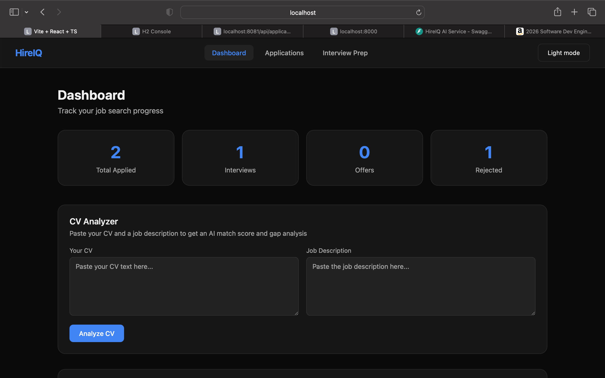
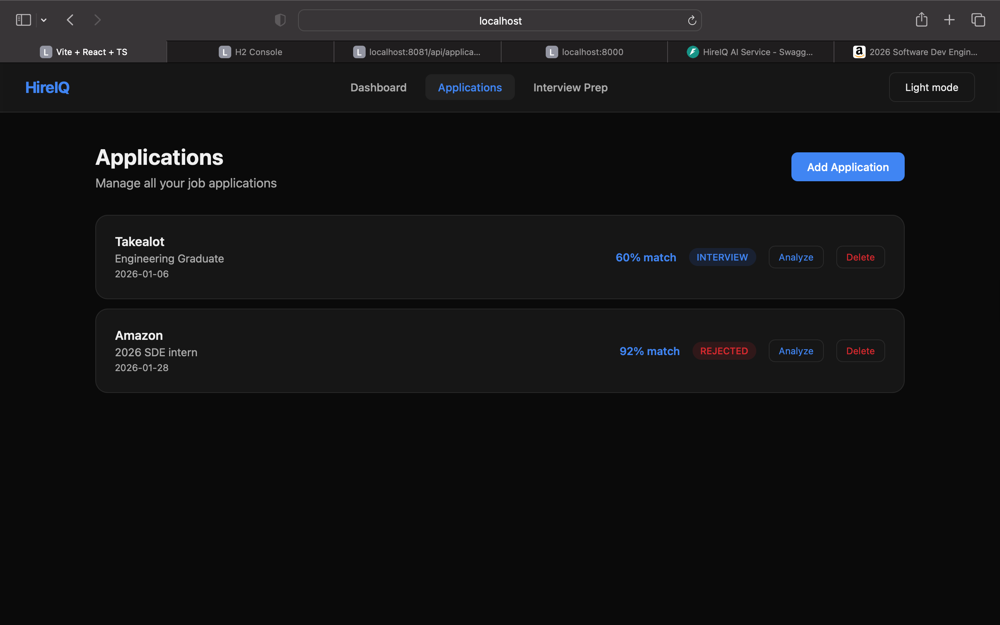
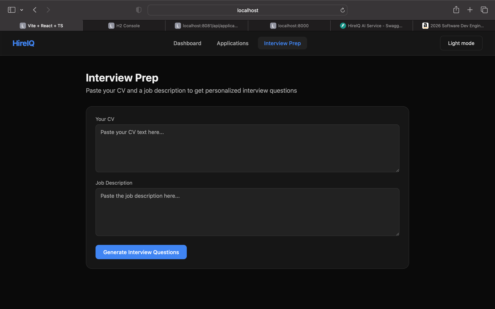

# HireIQ

An AI-powered career coach built for junior developers navigating the job market.

I built this because I was struggling with the same problems it solves — applying to jobs without knowing how well my CV matched, failing interviews without structured preparation, and losing track of where I had applied.

## Demo

[](https://youtu.be/hbGbsIawUyk)

## What it does

- Analyzes your CV against a job description and returns a match score with specific strengths and gaps
- Generates personalized technical and behavioural interview questions based on the actual job description
- Tracks all your job applications and their statuses in one place
- Match scores are saved against each application so you can see how strong each one is at a glance
- CV and job description persist across pages so you only paste once per session

## Architecture

```
Frontend (React + TypeScript) — port 5173
        ↓
Java Spring Boot API — port 8081
        ↓
Python FastAPI AI Service — port 8000
        ↓
Groq API (Llama 3.3 70b)
```

## Tech Stack

**Frontend**

- React with TypeScript
- Vite
- React Router

**Backend**

- Java Spring Boot 3.5
- Spring Data JPA
- H2 file-based database (dev)

**AI Service**

- Python FastAPI
- Groq API — Llama 3.3 70b

## Running locally

You need Java 17+, Python 3.11+, and Node.js installed.

Start all three services in separate terminal tabs.

**AI Service**

```bash
cd ai-service
python3 -m venv venv
source venv/bin/activate
pip install -r requirements.txt
cp .env.example .env
uvicorn main:app --reload
```

**Backend**

```bash
cd backend
./mvnw spring-boot:run
```

**Frontend**

```bash
cd frontend
npm install
npm run dev
```

Then open http://localhost:5173

## Environment variables

Create `ai-service/.env` with your Groq API key:

```
GROQ_API_KEY=your_groq_api_key_here
```

Get a free key at console.groq.com

## Screenshots

### Dashboard



### Applications



### Interview Prep



## Author

Alphiosjunior Ngqele

- GitHub: [@Alphiosjunior](https://github.com/Alphiosjunior)
- LinkedIn: [Alphiosjunior Ngqele](https://www.linkedin.com/in/alphiosjunior-iviwe-ngqele-8b510127a/)
- Email: ngqeleiviwe@gmail.com
